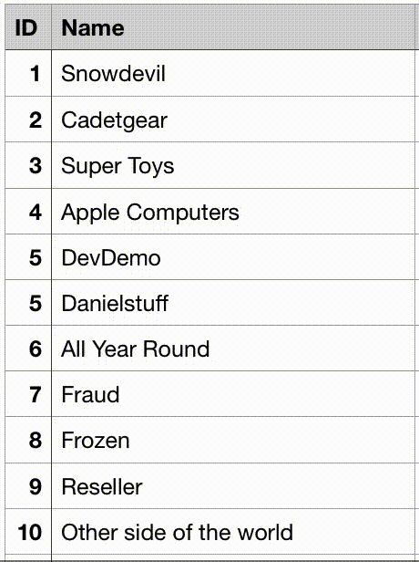

# Iteration: how it works

The main idea behind Iteration is to provide an API to describe jobs in interruptible manner, on the contrast with one massive `def perform` that is impossible to interrupt safely.



Exposing the enumerator and the action to apply allows us to keep the cursor and interrupt between iterations. Let's see how it looks like on example of an ActiveRecord relation (and Enumerator).

1. `build_enumerator` is called, which constructs `ActiveRecordEnumerator` from an ActiveRecord relation (`Product.all`)
2. The first batch of records is loaded:

```sql
SELECT  `products`.* FROM `products` ORDER BY products.id LIMIT 100
```

3. Job iterates over two records of the relation and then receives `SIGTERM` (graceful termination signal) caused by a deploy
4. Signal handler sets a flag that makes `job_should_exit?` to return `true`
5. After the last iteration is completed, we will check `job_should_exit?` which now returns `true`
6. The job stops iterating and pushes itself back to the queue, with the latest `cursor_position` value.
7. Next time when the job is taken from the queue, we'll load records starting from the last primary key that was processed:

```sql
SELECT  `products`.* FROM `products` WHERE (products.id > 2) ORDER BY products.id LIMIT 100
```

## Signals

It's critical to know UNIX signals in order to understand how interruption works. There are two main signals that Sidekiq and Resque use: `SIGTERM` and `SIGKILL`. `SIGTERM` is the graceful termination signal which means that the process should exit _soon_, not immediately. For Iteration, it means that we have time to wait for the last iteration to finish and to push job back to the queue with the last cursor position.
`SIGTERM` is what allows Iteration to work. In contrast, `SIGKILL` means immediate exit. It doesn't let the worker terminate gracefully, instead it will drop the job and exit as soon as possible.

Most of deploy strategies (Kubernetes, Heroku, Capistrano) send `SIGTERM` before the shut down, then wait for the a timeout (usually from 30 seconds to a minute) and send `SIGKILL` if the process haven't terminated yet.

Further reading: [Sidekiq signals](https://github.com/mperham/sidekiq/wiki/Signals).

## Enumerators

In the early versions of Iteration, `build_enumerator` used to return ActiveRecord relations directly, and we would infer the Enumerator based on the type of object. We used to support ActiveRecord relations, arrays and CSVs. This way it was hard to add support for anything else to enumerate, and it was easy for developers to make a mistake and return an array of ActiveRecord objects, and for us starting to threat that as an array instead of ActiveRecord relation.

In the current version of Iteration, it supports _any_ Enumerator. We expose helpers to build enumerators conveniently (`enumerator_builder.active_record_on_records`), but it's up for a developer to implement a custom Enumerator. Consider this example:

```ruby
class MyJob < ActiveJob::Base
  include JobIteration::Iteration

  def build_enumerator(cursor:)
    Enumerator.new do
      Redis.lpop("mylist") # or: Kafka.poll(timeout: 10.seconds)
    end
  end

  def each_iteration(element_from_redis)
    # ...
  end
end
```

Further reading: [ruby-doc](http://ruby-doc.org/core-2.5.1/Enumerator.html), [a great post about Enumerators](http://blog.arkency.com/2014/01/ruby-to-enum-for-enumerator/).
